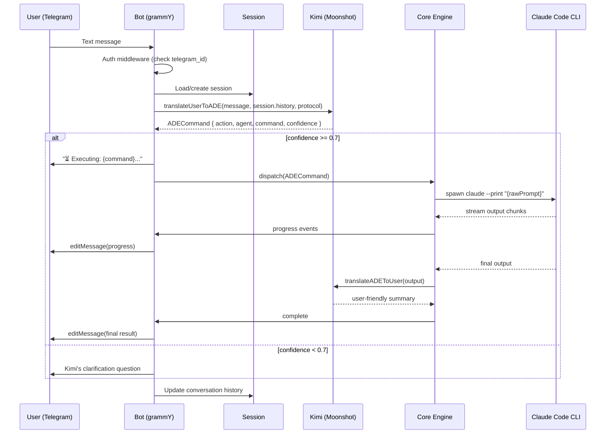
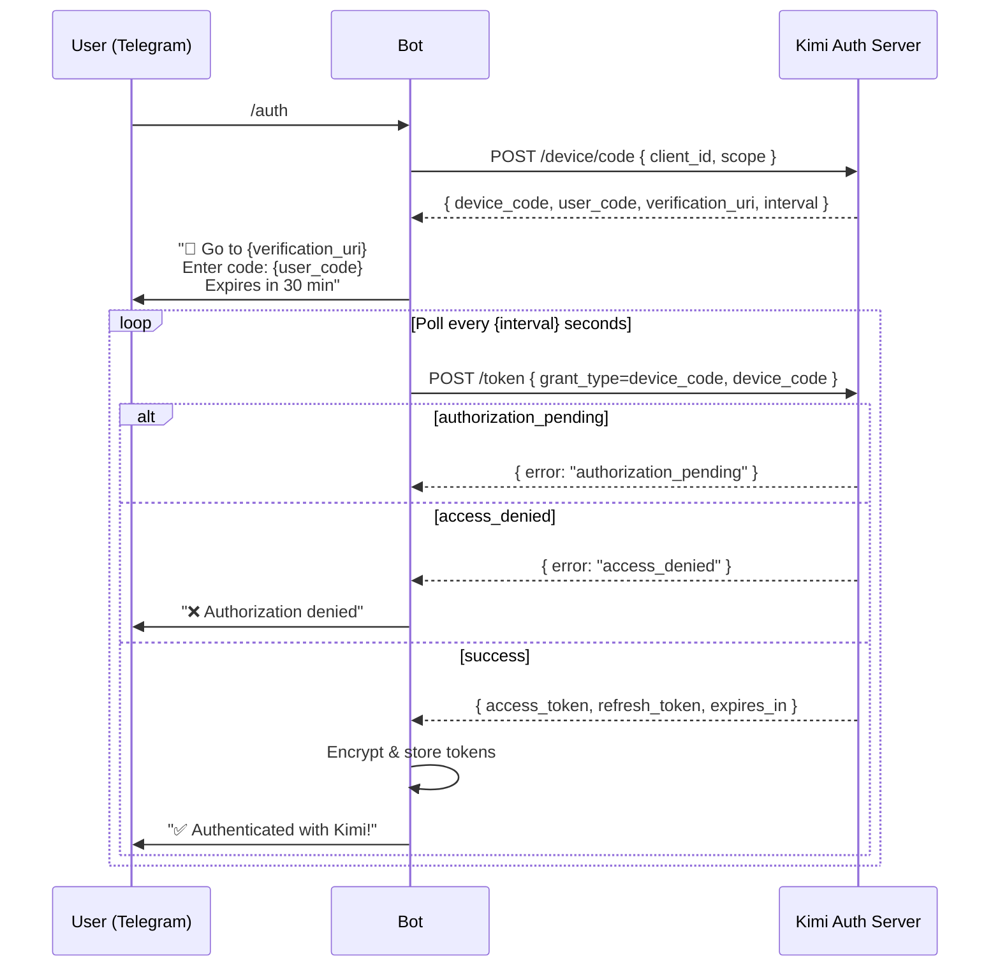
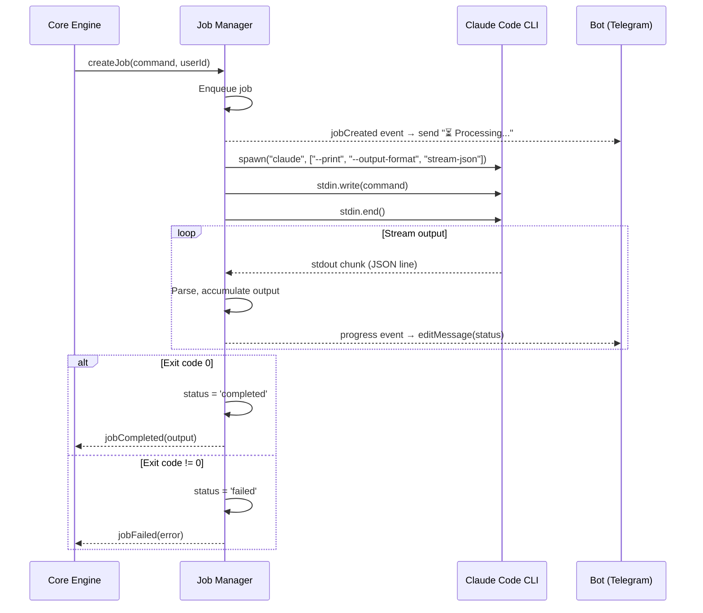
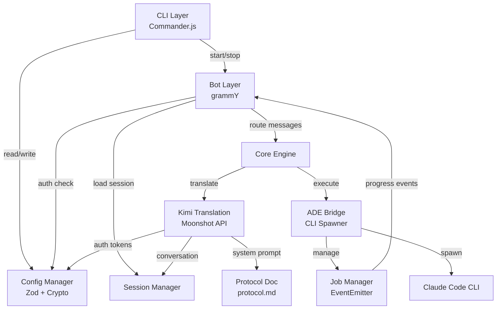

# Aurelia Telegram — Architecture Document

## Introduction

This document defines the complete system architecture for **Aurelia Telegram**, an open-source npm package that creates a conversational gateway between Telegram and the AIOS ADE (Autonomous Development Engine), using Kimi (Moonshot) as the natural language translation layer.

This is NOT a fullstack web application — it is a **Node.js CLI/Bot package** distributed via npm, where the bot runs locally or on a VPS and bridges Telegram ↔ Kimi ↔ Claude Code CLI.

**Starter Template:** N/A — Greenfield project

### Change Log

| Date | Version | Description | Author |
|------|---------|-------------|--------|
| 2026-02-05 | 0.1 | Initial architecture | Aria (Architect) |

---

## High Level Architecture

### Technical Summary

Aurelia Telegram is a single-process Node.js application distributed as an npm package. It runs a Telegram bot (grammY) that receives user messages, translates them to ADE commands via Kimi LLM (Moonshot API), executes those commands by spawning Claude Code CLI as a child process in headless mode (`--print`), then translates the ADE output back to user-friendly Telegram messages via Kimi. The system uses a middleware pipeline for request processing, an async job manager for long-running ADE operations, and per-user session isolation for multi-user support. Configuration is stored locally in `.aurelia/config.json` with encrypted sensitive values.

### Platform and Infrastructure

**Platform:** Local Node.js process (dev machine or VPS)
**Key Services:** Telegram Bot API, Kimi/Moonshot API, Claude Code CLI (local)
**Deployment:** Single process — `aurelia-telegram start`

No cloud infrastructure required. The bot runs wherever Claude Code is installed. For VPS deployment, the same package runs with an optional webhook mode and SQLite session persistence.

### Architecture Diagram

```
┌─────────────────────────────────────────────────────────────┐
│                     aurelia-telegram                         │
│                     (Node.js process)                        │
│                                                              │
│  ┌──────────┐    ┌───────────────────────────────────────┐  │
│  │          │    │          grammY Bot Layer              │  │
│  │   CLI    │    │  ┌─────┐ ┌──────┐ ┌───────┐ ┌─────┐  │  │
│  │ (Cmdr)   │───▶│  │Auth │→│Rate  │→│Session│→│Route│  │  │
│  │          │    │  │ MW  │ │Limit │ │  MW   │ │ MW  │  │  │
│  │ init     │    │  └─────┘ └──────┘ └───────┘ └──┬──┘  │  │
│  │ start    │    └────────────────────────────────┼──────┘  │
│  │ stop     │                                     │         │
│  │ status   │    ┌────────────────────────────────▼──────┐  │
│  │ config   │    │            Core Engine                 │  │
│  └──────────┘    │                                       │  │
│                  │  ┌─────────────┐  ┌────────────────┐  │  │
│  ┌──────────┐    │  │   Kimi      │  │   ADE Bridge   │  │  │
│  │ Config   │    │  │ Translation │  │  (CLI Spawner) │  │  │
│  │ Manager  │    │  │   Layer     │  │                │  │  │
│  │          │    │  │             │  │  ┌──────────┐  │  │  │
│  │ .aurelia/│    │  │ • Auth      │  │  │   Job    │  │  │  │
│  │ config   │    │  │ • Protocol  │  │  │ Manager  │  │  │  │
│  │ .json    │    │  │ • Translate │  │  │          │  │  │  │
│  └──────────┘    │  └─────────────┘  │  └──────────┘  │  │  │
│                  └───────────────────┴────────────────┘  │  │
│                           │               │              │  │
└───────────────────────────┼───────────────┼──────────────┘  │
                            │               │                  │
                   ┌────────▼──┐    ┌───────▼────────┐        │
                   │ Moonshot  │    │  Claude Code   │        │
                   │ API       │    │  CLI (--print) │        │
                   │ (Kimi)    │    │  (ADE Engine)  │        │
                   └───────────┘    └────────────────┘        │
```

### Architectural Patterns

- **Middleware Pipeline** (grammY): Request processing chain — Auth → Rate Limit → Session → Routing. Each middleware transforms or guards the context before passing to the next. _Rationale:_ grammY's native pattern, composable, testable, and allows clean separation of cross-cutting concerns.

- **Command Pattern**: Kimi translates natural language into structured `ADECommand` objects that are dispatched to the bridge. _Rationale:_ Decouples intent interpretation from execution, enables queuing, logging, and replay.

- **Observer/Event Pattern**: Job Manager emits progress events, Telegram handler subscribes to edit messages with updates. _Rationale:_ Decouples ADE process lifecycle from Telegram message management.

- **Strategy Pattern**: Deployment mode (local polling vs VPS webhook) selected at startup. _Rationale:_ Same codebase, different transport strategies without conditionals in business logic.

- **Adapter Pattern**: Kimi API wrapped behind a translation interface, allowing future swap to another LLM. _Rationale:_ Kimi is the preferred LLM but shouldn't be a hard dependency.

---

## Tech Stack

| Category | Technology | Version | Purpose | Rationale |
|----------|-----------|---------|---------|-----------|
| Language | TypeScript | 5.4+ | Primary language, strict mode | Type safety, better DX, catch errors at compile time |
| Runtime | Node.js | 18+ | Application runtime | LTS, native ESM, child_process API |
| Telegram SDK | grammY | 1.39+ | Bot framework | TypeScript-native, excellent middleware, active ecosystem |
| CLI Framework | Commander.js | 12+ | CLI commands (init, start, stop) | Mature, simple, already in AIOS deps |
| Validation | Zod | 3.22+ | Config and data validation | TypeScript-first, runtime validation with type inference |
| Logging | pino | 9+ | Structured logging | Fastest Node.js logger, JSON output, low overhead |
| Testing | Vitest | 2+ | Unit and integration tests | Fast, ESM-native, compatible with Vite ecosystem |
| Build | tsup | 8+ | TypeScript compilation + bundling | Zero-config, fast, ESM + CJS output |
| Linting | ESLint | 9+ | Code quality | Standard, flat config |
| Formatting | Prettier | 3+ | Code formatting | Industry standard |
| HTTP Client | undici | native | Kimi API calls | Node.js built-in fetch, no extra dep |
| Encryption | node:crypto | native | Token encryption at rest | No external dependency, AES-256-GCM |
| Session Store | better-sqlite3 | 11+ | Optional VPS session persistence | Lightweight, zero-config, serverless-friendly |
| Process Mgmt | node:child_process | native | Claude Code CLI spawn | Native Node.js, spawn with pipes |

---

## Data Models

### AureliaConfig

**Purpose:** Persistent configuration stored in `.aurelia/config.json`

```typescript
interface AureliaConfig {
  version: string;                    // Config schema version
  botToken: string;                   // Telegram bot token (encrypted)
  allowedUsers: number[];             // Telegram user IDs whitelist
  projectPath: string;                // Path to AIOS project
  deployMode: 'local' | 'vps';       // Deployment mode
  webhook?: {
    url: string;                      // Webhook URL for VPS mode
    port: number;                     // Webhook listen port
    secretToken?: string;             // Webhook secret for verification
  };
  kimi: {
    accessToken?: string;             // Kimi access token (encrypted)
    refreshToken?: string;            // Kimi refresh token (encrypted)
    expiresAt?: number;               // Token expiration timestamp
  };
  encryption: {
    salt: string;                     // Derived key salt
    iv: string;                       // Initialization vector
  };
}
```

### UserSession

**Purpose:** Per-user runtime context (in-memory, optionally persisted)

```typescript
interface UserSession {
  userId: number;                     // Telegram user ID
  authenticated: boolean;             // Kimi auth status
  activeProject: string;              // Current project path
  conversationHistory: ChatMessage[];  // Last N messages for Kimi context
  activeJobId: string | null;         // Currently running job
}

interface ChatMessage {
  role: 'user' | 'assistant' | 'system';
  content: string;
  timestamp: number;
}
```

### ADECommand

**Purpose:** Structured output from Kimi translation

```typescript
interface ADECommand {
  action: 'execute' | 'query' | 'approve' | 'cancel' | 'clarify';
  agent: string;                      // e.g. '@dev', '@qa', '@architect'
  command: string;                    // e.g. '*create-prd', '*run-tests'
  args: Record<string, unknown>;      // Command arguments
  confidence: number;                 // 0-1, threshold for auto-execution
  rawPrompt: string;                  // Full prompt to send to Claude Code
  clarification?: string;             // Question for user if confidence low
}
```

### Job

**Purpose:** Tracks async ADE operations

```typescript
interface Job {
  id: string;                         // UUID
  userId: number;                     // Owner
  command: string;                    // Claude Code command
  status: 'queued' | 'running' | 'completed' | 'failed' | 'cancelled';
  telegramMessageId?: number;         // Message being edited with progress
  telegramChatId?: number;            // Chat for progress updates
  output: string[];                   // Accumulated output chunks
  createdAt: number;
  startedAt?: number;
  completedAt?: number;
  error?: string;
}
```

---

## External APIs

### Telegram Bot API

- **Purpose:** Send/receive messages, inline keyboards, file uploads
- **Base URL:** `https://api.telegram.org/bot<token>/`
- **Authentication:** Bot token in URL path
- **Rate Limits:** 30 msg/sec globally, 1 msg/sec per chat for text, 20 msg/min per chat for groups
- **Integration:** Via grammY SDK (abstracted)

**Key Endpoints Used:**
- `sendMessage` — Send text responses
- `editMessageText` — Update progress messages in-place
- `sendDocument` — Send files (specs, stories)
- `answerCallbackQuery` — Respond to inline keyboard presses

### Moonshot / Kimi API

- **Purpose:** Natural language translation (user ↔ ADE)
- **Base URL:** `https://api.moonshot.ai/v1`
- **Authentication:** Bearer token (from device code flow or API key)
- **Rate Limits:** Per-account limits based on subscription tier
- **Context Window:** 256K tokens

**Key Endpoints Used:**
- `POST /chat/completions` — Translate user messages to ADE commands and ADE output to user-friendly text

**Integration Notes:** OpenAI-compatible API. Use Node.js native `fetch` with streaming for real-time translation. The system prompt includes the ADE Protocol Document for accurate translation.

### Claude Code CLI

- **Purpose:** Execute ADE commands
- **Interface:** Child process spawn (not HTTP API)
- **Authentication:** User's existing Claude Code subscription (pre-configured on machine)
- **Execution Mode:** Headless with `--print` flag and `--output-format stream-json`

**Key CLI Flags Used:**
- `--print` / `-p` — Non-interactive mode, outputs result to stdout
- `--output-format stream-json` — Newline-delimited JSON output for streaming
- `--continue` — Resume most recent conversation
- `--resume <session-id>` — Resume specific session
- `--allowedTools` — Restrict available tools
- `--append-system-prompt` — Inject additional context

---

## Core Workflows

### 1. Message Processing Flow



### 2. Kimi Device Code Authentication Flow



### 3. Job Execution Flow



---

## Components

### 1. CLI Layer (`src/cli/`)

**Responsibility:** npm package entry point. Parses commands, manages bot lifecycle.

**Key Interfaces:**
- `aurelia-telegram init` — Interactive setup wizard
- `aurelia-telegram start` — Start bot (foreground or daemon)
- `aurelia-telegram stop` — Stop running bot
- `aurelia-telegram status` — Show bot and connection status
- `aurelia-telegram config [key] [value]` — Get/set configuration

**Dependencies:** Config Manager, Bot Layer
**Technology:** Commander.js, inquirer (for init wizard prompts)

### 2. Bot Layer (`src/bot/`)

**Responsibility:** Telegram communication. Receives messages, applies middleware pipeline, routes to handlers.

**Key Interfaces:**
- `createBot(config): Bot` — Factory that assembles bot with middleware
- Middleware chain: `authMiddleware → rateLimitMiddleware → sessionMiddleware → routerMiddleware`
- Command handlers: `/start`, `/help`, `/status`, `/auth`, `/auth-status`, `/jobs`, `/cancel`
- Message handler: forwards text to Core Engine

**Dependencies:** Config, Session Manager
**Technology:** grammY, @grammyjs/runner (optional for VPS scaling)

### 3. Kimi Translation Layer (`src/kimi/`)

**Responsibility:** All Kimi LLM interactions — authentication, protocol management, bidirectional translation.

**Key Interfaces:**
- `KimiAuth` — Device code flow, token management, refresh
- `KimiTranslator.translateUserToADE(message, history, protocol): ADECommand`
- `KimiTranslator.translateADEToUser(output, context): string`
- `loadProtocol(): string` — Load ADE protocol document

**Dependencies:** Config (for tokens), Protocol document
**Technology:** Native fetch, Moonshot API (OpenAI-compatible)

#### Protocol Document (`src/kimi/protocol.md`)

This is the most critical asset in the system. It's a markdown file injected as Kimi's system prompt that describes:

```
# ADE Protocol Document v1.0

## You are a translator between a human user and the AIOS ADE system.

## Available Agents
- @dev (Dev) — Code implementation, bug fixes
- @qa (QA) — Testing, quality assurance
- @architect (Aria) — System architecture
- @pm (Morgan) — Product management, PRDs
- @po (Pax) — Product ownership, backlog
- @sm (River) — Scrum master, stories
- @analyst (Atlas) — Research, analysis

## Agent Commands
Each agent has commands prefixed with *:
- @pm: *create-prd, *create-epic, *research {topic}
- @dev: *develop-story, *build, *fix
- @qa: *run-tests, *review
- @architect: *create-full-stack-architecture
[... full command catalog ...]

## Translation Rules
1. User says "cria um PRD" → { agent: "@pm", command: "*create-prd" }
2. User says "roda os testes" → { agent: "@qa", command: "*run-tests" }
3. User asks "qual o status?" → { action: "query", command: "status" }
4. If unclear, ask for clarification (confidence < 0.7)

## Response Formatting
- Keep responses under 3000 chars (leave margin for Telegram's 4096 limit)
- Use Telegram-compatible markdown
- Summarize long outputs, offer to send full as file
```

### 4. ADE Bridge (`src/bridge/`)

**Responsibility:** Spawn and manage Claude Code CLI processes. Execute ADE commands and capture output.

**Key Interfaces:**
- `ClaudeCodeBridge.execute(prompt, options): AsyncIterable<OutputChunk>`
- `ClaudeCodeBridge.kill(): void`
- `ClaudeCodeBridge.isAvailable(): boolean` — Check if `claude` CLI exists

**Dependencies:** Node.js child_process
**Technology:** `node:child_process` spawn

**Implementation Detail:**
```typescript
// Spawn pattern for Claude Code CLI
const proc = spawn('claude', [
  '--print',
  '--output-format', 'stream-json',
  '--verbose'
], {
  cwd: projectPath,
  env: { ...process.env },
  stdio: ['pipe', 'pipe', 'pipe']
});

proc.stdin.write(prompt);
proc.stdin.end();

// Parse streaming JSON output
for await (const line of createLineStream(proc.stdout)) {
  const chunk = JSON.parse(line);
  yield chunk;
}
```

### 5. Job Manager (`src/bridge/job-manager.ts`)

**Responsibility:** Queue, track, and manage async ADE operations. Emit progress events.

**Key Interfaces:**
- `createJob(command, userId): Job`
- `cancelJob(jobId): void`
- `getActiveJobs(userId): Job[]`
- Events: `jobCreated`, `jobProgress`, `jobCompleted`, `jobFailed`

**Dependencies:** ADE Bridge, EventEmitter
**Technology:** Node.js EventEmitter, Map for job storage

### 6. Config Manager (`src/config/`)

**Responsibility:** Load, validate, encrypt, and persist configuration.

**Key Interfaces:**
- `loadConfig(projectPath): AureliaConfig`
- `saveConfig(config, projectPath): void`
- `encryptValue(value, key): string`
- `decryptValue(encrypted, key): string`

**Dependencies:** node:crypto, Zod
**Technology:** AES-256-GCM encryption, Zod schema validation

**Encryption Strategy:**
- Derive encryption key from machine-specific data (hostname + username) via PBKDF2
- Encrypt: `botToken`, `kimi.accessToken`, `kimi.refreshToken`
- Store salt and IV in config alongside encrypted values
- This prevents casual exposure, not nation-state attacks (appropriate for local config)

### 7. Session Manager (`src/session/`)

**Responsibility:** Per-user context isolation and persistence.

**Key Interfaces:**
- `getSession(userId): UserSession`
- `updateSession(userId, data): void`
- `clearSession(userId): void`

**Dependencies:** Config (for storage mode)
**Technology:** In-memory Map (default), better-sqlite3 (VPS mode)

### Component Interaction Diagram



---

## Project Structure

```
aurelia-telegram/
├── bin/
│   └── aurelia-telegram.js          # CLI entry point (#!/usr/bin/env node)
├── src/
│   ├── index.ts                     # Package main export
│   ├── cli/
│   │   ├── index.ts                 # Commander.js program setup
│   │   ├── commands/
│   │   │   ├── init.ts              # Interactive setup wizard
│   │   │   ├── start.ts             # Start bot
│   │   │   ├── stop.ts              # Stop bot
│   │   │   ├── status.ts            # Show status
│   │   │   └── config.ts            # Get/set config
│   │   └── wizard.ts                # Init wizard prompts
│   ├── bot/
│   │   ├── index.ts                 # Bot factory (createBot)
│   │   ├── middleware/
│   │   │   ├── auth.ts              # telegram_id whitelist check
│   │   │   ├── rate-limit.ts        # Per-user rate limiting
│   │   │   └── session.ts           # Session loading middleware
│   │   ├── handlers/
│   │   │   ├── commands.ts          # /start, /help, /status, /auth
│   │   │   ├── messages.ts          # Text message → Core Engine
│   │   │   └── callbacks.ts         # Inline keyboard callbacks
│   │   └── keyboards.ts             # Inline keyboard builders
│   ├── core/
│   │   └── engine.ts                # Orchestrates Kimi + Bridge flow
│   ├── kimi/
│   │   ├── auth.ts                  # Device code flow + token mgmt
│   │   ├── client.ts                # Moonshot API client
│   │   ├── translator.ts            # Bidirectional translation
│   │   └── protocol.md              # ADE knowledge base for Kimi
│   ├── bridge/
│   │   ├── claude-code.ts           # CLI spawner + stream parser
│   │   └── job-manager.ts           # Async job tracking + events
│   ├── config/
│   │   ├── schema.ts                # Zod config schema
│   │   ├── manager.ts               # Load/save/encrypt config
│   │   └── encryption.ts            # AES-256-GCM helpers
│   ├── session/
│   │   ├── manager.ts               # Session manager (memory/sqlite)
│   │   └── store-sqlite.ts          # SQLite adapter
│   └── utils/
│       ├── logger.ts                # pino logger setup
│       ├── message-splitter.ts      # Split long messages for Telegram
│       └── telegram-format.ts       # Markdown formatting for Telegram
├── tests/
│   ├── unit/
│   │   ├── config/
│   │   ├── kimi/
│   │   ├── bridge/
│   │   ├── bot/
│   │   └── session/
│   └── integration/
│       └── flows/
├── docs/
│   ├── prd.md
│   └── architecture.md
├── package.json
├── tsconfig.json
├── tsup.config.ts
├── vitest.config.ts
├── eslint.config.js
├── .prettierrc
├── .gitignore
├── LICENSE
└── README.md
```

---

## Security Architecture

### Authentication Layers

```
Layer 1: Telegram Bot Token
├── Identifies the bot to Telegram API
├── Stored encrypted in .aurelia/config.json
└── Never logged, never exposed in error messages

Layer 2: Telegram ID Whitelist
├── Array of numeric telegram_ids in config
├── Auth middleware rejects non-whitelisted users immediately
├── Rejection message: generic "Unauthorized" (no info leakage)
└── Checked on EVERY message (not just /start)

Layer 3: Kimi Device Code Auth
├── User authenticates via device code flow
├── Access token + refresh token stored encrypted
├── Auto-refresh before expiration
└── /auth-status command to verify

Layer 4: Claude Code Subscription
├── Pre-configured on host machine
├── Aurelia does NOT manage Claude Code auth
├── Assumes `claude` CLI is authenticated
└── Validated at startup with `claude --version`
```

### Encryption at Rest

- **Algorithm:** AES-256-GCM (authenticated encryption)
- **Key Derivation:** PBKDF2 from machine fingerprint (hostname + username + static salt)
- **Encrypted fields:** `botToken`, `kimi.accessToken`, `kimi.refreshToken`
- **Purpose:** Prevent casual exposure of secrets in config files. Not designed to resist determined attackers with machine access.

### Input Validation

- All Telegram messages sanitized before passing to Kimi
- Claude Code commands validated against allowlist before spawn
- Config validated with Zod schema on every load
- Environment variables validated at startup

### Rate Limiting

- Per-user: 30 messages/minute (configurable)
- Per-job: 1 concurrent ADE operation per user
- Kimi API: Respect upstream rate limits with exponential backoff

---

## Performance Considerations

### Response Time Targets

| Operation | Target | Strategy |
|-----------|--------|----------|
| Simple queries (/help, /status) | < 500ms | Direct response, no LLM call |
| Kimi translation | < 3s | Streaming response, show "typing..." |
| ADE operation start | < 5s | Immediate "⏳" acknowledgment |
| ADE progress updates | Every 5-10s | Edit existing message |

### Message Handling

- **Splitting:** Messages > 4000 chars split at paragraph/code-block boundaries
- **Streaming:** Kimi responses streamed to reduce perceived latency
- **Editing:** Progress updates edit existing message (1 msg, not spam)
- **Files:** Outputs > 10K chars sent as `.txt` document attachment

### Process Management

- One Claude Code CLI process per user at a time
- Job queue for pending commands (FIFO per user)
- Configurable timeout per operation (default: 10 min)
- Kill zombie processes on shutdown

---

## Error Handling Strategy

### Error Categories

```typescript
// Base error class
class AureliaError extends Error {
  constructor(
    message: string,
    public code: string,
    public userMessage: string,  // Safe to show in Telegram
    public recoverable: boolean
  ) {
    super(message);
  }
}

// Specific errors
class KimiAuthError extends AureliaError { }     // Auth failed/expired
class KimiTranslationError extends AureliaError { } // Translation failed
class BridgeError extends AureliaError { }        // Claude Code CLI error
class ConfigError extends AureliaError { }        // Invalid configuration
class SessionError extends AureliaError { }       // Session not found
```

### Error Flow

1. Error occurs in any layer
2. Caught by Core Engine
3. Logged with full context (pino, structured JSON)
4. User receives `userMessage` in Telegram (safe, no internals)
5. If recoverable, suggest action (retry, /auth, check config)
6. If not recoverable, suggest contacting admin or checking logs

### Graceful Shutdown

```
SIGINT/SIGTERM received
  → Stop accepting new messages
  → Wait for active jobs (max 30s timeout)
  → Kill any remaining Claude Code processes
  → Flush log buffers
  → Close SQLite connections
  → Stop grammY polling/webhook
  → Exit(0)
```

---

## Testing Strategy

### Test Pyramid

```
         E2E (manual)
        /            \
   Integration (10%)
      /            \
  Unit Tests (90%)
```

### Unit Tests (Vitest)

| Module | What to Test | Mocking |
|--------|-------------|---------|
| Config | Schema validation, encrypt/decrypt, load/save | File system |
| Kimi Auth | Token flow, refresh logic, error handling | HTTP responses |
| Kimi Translator | Translation parsing, confidence scoring | Kimi API responses |
| Bridge | Command building, output parsing, timeout | child_process |
| Job Manager | Job lifecycle, queue, events | Bridge |
| Bot Middleware | Auth check, rate limit, session load | grammY context |
| Message Splitter | Splitting logic, boundary detection | None (pure) |

### Integration Tests

- Full flow: mock Telegram message → real Kimi translation → mock Claude Code → Telegram response
- Auth flow: mock device code endpoints → token storage → verification
- Config: write encrypted config → read back → validate

### Test Commands

```bash
npm test              # Run all tests
npm run test:unit     # Unit tests only
npm run test:watch    # Watch mode
npm run test:coverage # Coverage report
```

---

## Coding Standards

### Critical Rules

- **Config Access:** Always access config through `ConfigManager`, never read `.aurelia/config.json` directly
- **Secrets in Logs:** NEVER log tokens, API keys, or encrypted values. Use `logger.info({ userId }, 'message')` pattern
- **Error Messages:** Always separate internal error (logged) from user-facing message (sent to Telegram)
- **Process Cleanup:** Every spawned Claude Code process MUST be tracked and killed on shutdown
- **Async/Await:** All async operations must have proper error handling, no unhandled promise rejections
- **Imports:** Use ESM imports (`import`), no CommonJS (`require`)

### Naming Conventions

| Element | Convention | Example |
|---------|-----------|---------|
| Files | kebab-case | `job-manager.ts` |
| Classes | PascalCase | `JobManager` |
| Functions | camelCase | `translateUserToADE()` |
| Constants | UPPER_SNAKE | `MAX_MESSAGE_LENGTH` |
| Interfaces | PascalCase, I-prefix optional | `ADECommand` |
| Config keys | camelCase | `botToken` |
| CLI commands | kebab-case | `aurelia-telegram start` |
| Telegram commands | lowercase | `/auth`, `/status` |

---

## Development Workflow

### Prerequisites

```bash
node --version  # >= 18.0.0
npm --version   # >= 9.0.0
claude --version  # Claude Code CLI installed and authenticated
```

### Setup

```bash
git clone <repo>
cd aurelia-telegram
npm install
npm run build
```

### Development Commands

```bash
npm run dev        # Watch mode (tsup --watch)
npm run build      # Production build
npm test           # Run tests
npm run lint       # ESLint check
npm run lint:fix   # ESLint fix
npm run typecheck  # TypeScript type check
npm run format     # Prettier format
```

### Environment Variables (optional, override config)

```bash
AURELIA_BOT_TOKEN=<telegram-bot-token>
AURELIA_ALLOWED_USERS=123456789,987654321
AURELIA_PROJECT_PATH=/path/to/aios/project
AURELIA_DEPLOY_MODE=local
AURELIA_KIMI_API_KEY=<fallback-api-key>
AURELIA_LOG_LEVEL=info
```

---

## Deployment Modes

### Local Mode (Default)

```
Developer's Machine
┌─────────────────────────────┐
│ aurelia-telegram (polling)   │
│         │                    │
│         ├── Claude Code CLI  │
│         └── .aurelia/config  │
└─────────────────────────────┘
         │
    Long Polling
         │
    Telegram API
```

- Bot uses long polling (no public URL needed)
- Claude Code CLI on same machine
- Config in project directory
- Sessions in memory (single user, typically)

### VPS Mode

```
VPS Server
┌─────────────────────────────┐
│ aurelia-telegram (webhook)   │
│         │                    │
│         ├── Claude Code CLI  │
│         ├── .aurelia/config  │
│         └── SQLite sessions  │
└─────────────────────────────┘
         │
    Webhook (HTTPS)
         │
    Telegram API
```

- Bot uses webhook (requires public HTTPS URL)
- Claude Code CLI installed on VPS
- SQLite for session persistence across restarts
- Supports multiple users concurrently

---

## Next Steps

### Dev Agent Prompt

> @dev — Implement Story 1.1 (Project Scaffolding) following this architecture document. Create the TypeScript project with tsup build, Vitest testing, ESLint + Prettier, and the directory structure defined in the Project Structure section. The package should be named `aurelia-telegram` with a `bin/aurelia-telegram.js` entry point. Use ESM modules throughout.
